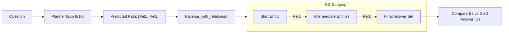

# Shared Core Specifications: The Universal KGQA Engine

## 1. Introduction: The Hardware Constraint Problem (The "Why")
Knowledge Graphs like **Freebase** contain over **1.9 Billion triples** and require approximately **400GB to 1TB of RAM** to load into a standard graph database (like Neo4j or Virtuoso) for real-time querying.

In a research environment, loading the entire Freebase structure is often impossible. This project solves this using a **Gold Subgraph Simulation** strategy. We extract the exact "veins" of the Knowledge Graph needed for our questions, allowing us to perform high-fidelity physics-based execution with only **~2GB of RAM**.

---

## 2. SPARQL Parsing Logic (`utils/sparql_parser.py`)

The system converts raw SPARQL strings from the CWQ dataset into actionable (subject, relation, object) triples.

### Triple Extraction Patterns
We use a dual-regex strategy implemented in `extract_triples(sparql)`:

1.  **Standard Triple**: `(\?\w+|ns:[mg]\.[\w\d_]+)\s+ns:([\w\d\._]+)\s+(\?\w+|ns:[mg]\.[\w\d_]+)\s*\.`
    *   *Matches*: `ns:m.01_dwn ns:sports.sports_team.team_mascot ?y .`
2.  **Inverse Triple (The `^` Fix)**: `(\?\w+|ns:[mg]\.[\w\d_]+)\s+\^ns:([\w\d\._]+)\s+(\?\w+|ns:[mg]\.[\w\d_]+)\s*\.`
    *   *Matches*: `?y ^ns:sports.mascot.team ?x .`
    *   *Logic*: The parser automatically "flips" these triples at extraction time to maintain a consistent graph orientation.

### Hop Supervision Extraction
The `find_reasoning_path(sparql)` function performs a **Breath-First Search (BFS)** on the extracted triples from a known Entity Constant (e.g., `ns:m.01_dwn`) to the Answer Variable (e.g., `?x`). This produces the **Gold Sequence** of relations used to train the planners in Experiments 1-10.

---

## 3. Knowledge Graph Loader (`shared/kg_loader.py`)

The `KnowledgeGraph` class is the project's in-memory "Digital Twin" of the knowledge silos.

### Data Structures
*   **`self.forward`**: A `defaultdict(list)` mapping `Subject -> [(Relation, Object)]`.
*   **`self.backward`**: A `defaultdict(list)` mapping `Object -> [(Relation, Subject)]`.

### Bidirectional Traversal Logic
The `get_neighbors(entity)` function queries both dictionaries simultaneously. This is critical because a question like "Who is the mascot of the Giants?" might be stored in the KG as `(Mascot) -[mascot_of]-> (Giants)` or `(Giants) -[has_mascot]-> (Mascot)`. By providing both `+1` (forward) and `-1` (backward) directions, the planners effectively ignore the arbitrary directionality of the triples.

---

## 4. Execution-Based Evaluation (`eval/execution_eval_all.py`)

This is the final arbiter of truth. Unlike "Relation Accuracy" (which just checks if the AI guessed the right word), **Execution Accuracy** physically walks the graph.

### The Traversal Pipeline

### Answer Scoring (Hits@1)
1.  **Set Retrieval**: The traversal returns the set of all entities reachable by the predicted path.
2.  **Gold Match**: If the set of reached entities has **any intersection** with the Gold Answers provided in the JSON, the question is marked as correct (**1.0**).
3.  **Dead Ends**: If the model predicts a non-existent relation (e.g., `film.director` when the entity is a `SportsTeam`), the result set becomes **empty**, and the score is **0.0**.

---

## 5. The "Gold Subgraph" Strategy Revisited
**Why is this statistically valid?**
A question in CWQ is answered by a specific SPARQL query. That SPARQL query represents a "proof" that the answer exists in Freebase. By harvesting all triples from all SPARQL queries in the dataset, we essentially build a Knowledge Graph that contains **100% of the relevant evidence** while discarding the hundreds of millions of irrelevant triples (e.g., weather data from 1994) that would otherwise choke system memory.

---

## 6. File Reference Matrix
| Component | Implementation File | Primary Function |
| :--- | :--- | :--- |
| **Triple Parsing** | [`utils/sparql_parser.py`](file:///c:/Users/swoop/dev/res/kgqa/kgqaHierarchical/utils/sparql_parser.py) | Translates SPARQL strings to (S, R, O) tuples. |
| **Graph Structure** | [`shared/kg_loader.py`](file:///c:/Users/swoop/dev/res/kgqa/kgqaHierarchical/shared/kg_loader.py) | In-memory bidirectional adjacency list. |
| **Evaluation Loop** | [`eval/execution_eval_all.py`](file:///c:/Users/swoop/dev/res/kgqa/kgqaHierarchical/eval/execution_eval_all.py) | Higher-fidelity physical traversal engine. |
| **Model Loader** | [`shared/utils.py`](file:///c:/Users/swoop/dev/res/kgqa/kgqaHierarchical/shared/utils.py) | Surgical weight resizing for vocab expansion. |
