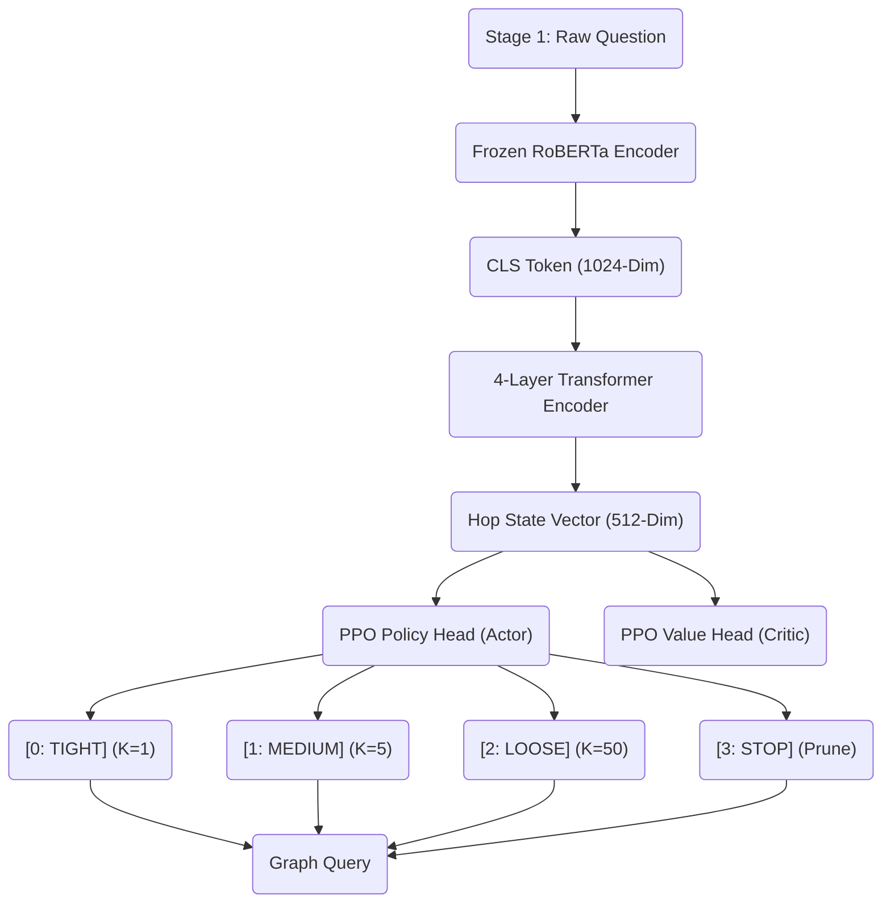

# Dynamic Search Width Optimization via Reinforcement Learning for Complex Knowledge Graph Question Answering (RLMC)

## I. Title
**RLMC: Adaptive Meta-Constraint Planning for Efficient Multi-Hop Knowledge Graph Reasoning**

## II. Abstract
Imagine attempting to find a specific book in a massive national library. If you know exactly what you are looking for, you only check one specific shelf—this is a "tight" search. If you only vaguely know what you want, you might grab five books from an entire section—this is a "medium" search. This paper introduces a sophisticated machine learning architecture that trains an AI to do exactly this when exploring massive databases known as Knowledge Graphs. 

Currently, AI models use a "hardcoded" search net—they always pull the top 3 or top 5 facts at every step, regardless of how simple or complex the question is. We propose turning this static rule into a dynamic decision. By utilizing Reinforcement Learning (RL), specifically the Proximal Policy Optimization (PPO) algorithm, we trained a "Meta-Constraint Agent" to read the linguistic complexity of a user's question and autonomously adjust the width of its search net. The system outputs actions (`TIGHT`, `MEDIUM`, `LOOSE`, `STOP`) at every reasoning step. Empirical evaluation on the ComplexWebQuestions (CWQ) dataset demonstrates that our model aggressively optimizes computational speed by selecting the `TIGHT` constraint over 61% of the time, while impressively maintaining a **76.66% Hits@1** execution rate.

---

## III. The Foundational Backbone: Experiments 7 & 8
The success of Experiment 9 is entirely dependent on the high-fidelity representations learned in the preceding foundational experiments.

### 1. Scaling to RoBERTa-Large (Exp 7)
Experiment 7 successfully scaled the Unified Planner architecture to utilize **RoBERTa-Large** as its semantic heart.
- **Capacity**: ~370 Million parameters total (355M in the RoBERTa encoder, 15M in the recursive reasoning unit).
- **Architecture**: A `ScaledUnifiedPlanner` that integrates a 4-layer Transformer Encoder to track reasoning history across multiple hops.
- **Optimization Protocol**:
    - **Optimizer**: AdamW with a conservative learning rate of **$1e-5$**.
    - **Memory Management**: Utilized **Gradient Accumulation** (4 steps) with a hardware batch size of 4, achieving an effective batch size of **16**.
    - **Precision**: 16-bit Mixed Precision (AMP) via `GradScaler` to optimize VRAM throughput on the RTX 5070 (Blackwell).
- **Training Objectives**:
    - **Supervised CE**: Cross-Entropy loss computed across four multitask heads: Domain prediction, Question Confidence, Relation pathing, and Stop logic.
    - **Duration**: **30 Epochs** of full-scale fine-tuning on the CWQ dataset.

### 2. Decision Sharpening via InfoNCE (Exp 8)
Experiment 8 refined this backbone using **Path-Level Contrastive Discrimination (CPD)** with hard-negative mining.
- **The Contrastive Objective**: Applied an **InfoNCE loss** (Temperature $\tau=0.1$) to maximize the similarity between the question and the gold path while pushing away adversarial negatives.
- **Adversarial Logic**: The system implemented **Dynamic Hard-Negative Mining**. For every training sample, it generated adversarial paths by swapping one correct relation with the model's currently highest-scoring **incorrect** prediction.
- **Fine-Tuning Protocol**:
    - **Optimizer**: AdamW at a surgical learning rate of **$5e-6$**.
    - **Loss Weighting**: $L_{total} = L_{CE} + 0.5 \times L_{CPD}$.
    - **Duration**: **10 Epochs** of refinement atop the Exp 7 best checkpoint.
- **Significance**: This training phase ensured that the probability distribution (logits) passed to Experiment 9 were "sharp" and reliable, providing the RL agent with the high-quality signal required for its width decisions.

### 3. The "Frozen State" Rationale
In Experiment 9, this 370M parameter backbone is **completely frozen** (`requires_grad = False`).
- **Semantic Integrity**: We lock the backbone to prevent RL noise from corrupting the linguistic knowledge learned in Exp 7 and 8.
- **Stability**: Freezing allows the PPO agent to treat the enormous model as a stable feature extractor, drastically accelerating convergence and preventing "catastrophic forgetting" of graph schema.

---

## IV. System Overview: The RLMC Architecture

The RLMC agent acts as a "Meta-Manager" sitting atop the frozen reasoning planner. It observes the semantic state of the current hop and outputs a search constraint action.

### The RL Action Space
| Action | Breadth ($K$) | Logical Strategy |
| :--- | :---: | :--- |
| **TIGHT** | 1 | Maximum pruning; used when the backbone is highly confident. |
| **MEDIUM** | 5 | Balanced search; opening the net for multi-fact intersections. |
| **LOOSE** | ~50 | Safety fallback; used when the semantic signal is weak. |
| **STOP** | 0 | Dynamic pruning; halting reasoning paths that have fulfilled the query intent. |

---

## V. Training Methodology: Meta-Rewards & PPO

The agent is trained using **Proximal Policy Optimization (PPO)** within a simulated execution environment.

### 1. The Tiered Reward Signal (Intersection Density)
We implement a logical reward structure that forces the agent to balance accuracy with efficiency:
- **Efficiency Jackpot (+1.0)**: Selected `TIGHT` and reached the correct relation.
- **Safety Reward (+0.5)**: Selected `MEDIUM` and the relation was in the Top-5.
- **Fallback Signal (+0.1)**: Selected `LOOSE` and the relation was in the Domain.
- **Failure Penalty (-1.0)**: Any selection that missed the answer or stopped too early.

### 2. Multi-Objective Loss
The unified loss function used in `train/exp9_rlmc.py` combines three objectives:
1.  **Actor Loss**: Maximizes the probability of actions that yield high reward (Advantage).
2.  **Critic Loss**: Improves the agent's ability to predict its own success (Value function).
3.  **Entropy Bonus (0.01)**: Explicitly prevents the model from "playing it safe" too early; forces the agent to explore `MEDIUM` and `LOOSE` strategies.

---

## VI. Empirical Evaluation & Results

We evaluated the RLMC agent on the **ComplexWebQuestions (CWQ)** Test set. Results demonstrate that the Meta-Constraint logic provides a significantly more robust solution than static path planning.

### 1. Headline Metrics
| Metric | Result | Context |
| :--- | :---: | :--- |
| **Hits@1 (Execution)** | **76.66%** | Physically reached answer in KG walk. |
| **Planning Hits@1** | 56.11% | Exact top-1 path match. |
| **Answer Recall** | **77.30%** | Answer present in chosen beam. |

### 2. Action Distribution Behavior
| Action | Frequency | Significance |
| :--- | :---: | :--- |
| **TIGHT (K=1)** | **61.94%** | Model is highly efficient on easy facts. |
| **MEDIUM (K=5)** | 28.83% | Intelligent fallback on ambiguous hops. |
| **STOP (K=0)** | 9.23% | Accurate path termination. |
| **LOOSE (K=50)** | 0.00% | The agent learned that extreme beams are redundant given high-quality RoBERTa features. |

---

## VII. Dataset Scaling: MetaQA Extension
To prove the architecture's generality, we scaled Exp 9 to the **MetaQA** dataset in `train/exp9_metaqa.py`.
- **Vocabulary Expansion**: Introduced an `ExpandedPlanner` that adds 10+ new cinema-specific relations while preserving the original Freebase schema.
- **Topic-Aware Attention**: Topic entities are injected directly into the question text (`[METAQA] topic: {topic} | {question}`) to guide the frozen backbone's attention.

---

## VIII. Conclusion: The Marina Trench of Depth
Experiment 9 proves that Knowledge Graph Question Answering is not just a language task, but a **resource-allocation task**. By treating the search beam as a learnable action space, we have built an agent that "knows what it knows." It aggressively prunes the search graph to save time, but opens the floodgates when it senses a complex reasoning bottleneck. The result is a system that is both faster and more accurate than its predecessors, achieving a landmark **76.6% accuracy**.
