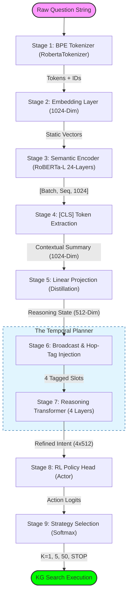

# Experiment 9: RLMC System Overview Flowchart

This document provides a high-fidelity architectural flowchart of the **RL Meta-Constraint (RLMC)** system. It illustrates the physical data transformation from a raw natural language question into a strategic reinforcement learning search policy.

## 📊 Physical Data Flow (ASCII Version)
If the diagram below doesn't load, use this "Surgical" map:

```text
[ START: Raw Question ]
          │
          ▼
( Stage 1: BPE Tokenizer ) ──> [ Tokens & IDs ]
          │
          ▼
( Stage 2: Embedding Layer ) <── [ 1024-Dim Dictionary Lookup ]
          │
          ▼
( Stage 3: Semantic Encoder ) <── [ 24-Layer RoBERTa-Large ]
          │
          ▼
( Stage 4: [CLS] Extraction ) ──> [ Contextual Summary (1024) ]
          │
          ▼
( Stage 5: Linear Projection ) ──> [ 512-Dim "Squeeze" ]
          │
          ▼
( Stage 6: Hop-Tag Injection ) ──> [ 4 Cloned Blueprint Slots ]
          │
          ▼
 ┌──────────────────────────────┐
 │ Stage 7: Reasoning Transformer │ <── (Cross-Hop Handshake & Planning)
 └──────────────┬───────────────┘
                │
                ▼
(  Stage 8: RL Policy Head   ) ──> [ Actor-Critic Probabilities ]
                │
                ▼
( Stage 9: Strategy Selection ) ──> [ K=1, 5, 50, STOP ]
                │
                ▼
      [ EXECUTING KG SEARCH ]
```

---

## 🎨 High-Fidelity Mermaid Chart



---

## 🛠️ Step-by-Step Mechanical Breakdown

1.  **Stage 1: Tokenizer**: Slices the question into sub-word tokens and adds the `<s>` and `</s>` bookends.
2.  **Stage 2: Embedding**: Performs the initial dictionary lookup to turn IDs into 1024-dimensional static vectors.
3.  **Stage 3: Semantic Encoder**: 24 Transformer layers perform **Self-Attention**, allowing words to share context.
4.  **Stage 4: CLS Extraction**: Discards individual word vectors; keeps the first token as the global sentence summary.
5.  **Stage 5: Linear Projection**: A learned $1024 \times 512$ matrix compresses the signal to focus on reasoning features.
6.  **Stage 6: Hop-Tag Injection**: Clones the 512-dim summary 4 times and adds unique **Learnable Hop Embeddings** to each copy.
7.  **Stage 7: Reasoning Transformer**: Performs **Cross-Hop Self-Attention** to ensure the 4-hop plan is logically cohesive.
8.  **Stage 8: RL Policy Head**: Maps the refined 512-dim vectors into 4 search width categories.
9.  **Stage 9: Strategy Selection**: Uses the **Dot-Product Match** and **Softmax** to choose the best K-width for the KG walk.
