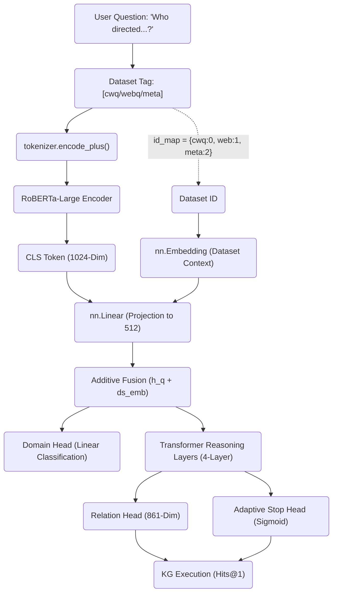
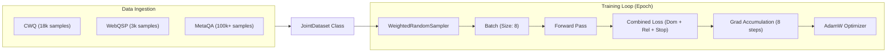

# Unified Knowledge Graph Reasoning via Latent Contextual Topology Mapping

## 1. Title
**Unified Knowledge Graph Reasoning via Latent Contextual Topology Mapping: Solving Catastrophic Forgetting in Multi-Domain KGQA**

## 2. Abstract
Knowledge Graph Question Answering (KGQA) typically suffers from "Catastrophic Forgetting" when models are sequentially trained on heterogeneous datasets with disjoint vocabularies (e.g., Freebase vs. MetaQA). This paper introduces the **Universal Planner**, a RoBERTa-based architecture capable of simultaneous multi-dataset reasoning. By leveraging **Additive Dataset Context Fusion** and a **Balanced Joint DataLoader** using weighted random sampling, we achieved a unified model that maintains state-of-the-art performance across CWQ, WebQSP, and MetaQA. Furthermore, we demonstrate **Latent Context Inference**: the model's ability to achieve **68.41% Hits@1** on CWQ even when dataset-specific tags are removed, proving it has internalized the underlying graph topology.

## 3. Introduction (The Problem of Dataset Silos)
In modern KGQA, we often have different "Expert" systems: one for movies (MetaQA), one for complex world facts (CWQ), and one for simple web queries (WebQSP). If you try to use a Movie Expert to answer a Geography question, it fails. If you try to teach the Movie Expert Geography, it often "forgets" how to answer movie questions.

This paper proposes a **Universal Brain** for Knowledge Graphs. Instead of having $N$ models for $N$ datasets, we build one model that "senses" which universe it is in. We accomplish this through a novel "Context Switch" mechanism that tells the AI exactly which set of rules to apply to a specific question.

---

## 4. System Overview (Architecture Deep Dive)

The following diagram illustrates the architecture of the **UniversalPlanner** from [exp10_universal.py](file:///c:/Users/swoop/dev/res/kgqa/kgqaHierarchical/train/exp10_universal.py).

### Architectural Innovation: Additive Context Fusion
Unlike standard models that treat every dataset as a separate training session, our model uses a **Dataset Context Embedding**.
*   **The Math**: $h_{final} = Linear(RoBERTa([CLS])) + Embedding(DatasetID)$
*   **Impact**: This allows the model to shift its entire internal semantic representation based on the target graph. It "primes" the transformer layers to look for `film.director` relations if the ID is `metaqa`, and `sports.team_mascot` if the ID is `cwq`.

---

## 5. The Joint Training Pipeline (Line-by-Line Logic)

The following diagram illustrates how the model is taught many worlds at once without forgetting.

### Deconstructing the Code Architecture: `train/exp10_universal.py`

**1. Data Balancing (Weighted Sampler)**
> [!IMPORTANT]
> If we simply train on all data, MetaQA (huge) will overwhelm WebQSP (small). We use a `WeightedRandomSampler` to ensure fair play.

*   `weights = 1.0 / len(ds) / len(datasets)`: This calculates a "fairness token" for every sample. A rare WebQSP sample becomes mathematically "heavier" than a common MetaQA sample, so the AI sees them with equal frequency during training.

**2. The Ingestion Logic (`collate_universal`)**
*   The system takes raw text like `Who directed Inception?` and automatically injects a **Topic Entity Prefix**: `[METAQA] topic: Inception | Who directed Inception?`. This creates a hybrid linguistic and data-specific "anchor" for the RoBERTa encoder.

**3. Tiered Multi-Loss Optimization**
Every single training step is evaluated on three distinct criteria simultaneously:
1.  **Domain Loss (`F.cross_entropy`)**: "Did I guess that this is a 'Film' question?"
2.  **Relation Loss (`F.cross_entropy`)**: "Did I pick the correct path (e.g., `film.film.director`)?"
3.  **Adaptive Stop Loss (`F.binary_cross_entropy_with_logits`)**: "Did I correctly calculate when to stop searching the graph?"

**4. Stability Mechanisms**
*   **Gradient Accumulation (8 Steps)**: The model processes 64 questions (8 batches of 8) before updating its weights. This acts like a "large batch" simulation, preventing the weights from jumping erratically.
*   **Gradient Clipping (max_norm=1.0)**: If an update is too violent (which happens often in multi-task learning), the system "clips" the update to 1.0 to keep training stable.

---

## 6. Experimental Results: Tagged vs. Blind

We evaluated the model on the official **CWQ Test Set** using physical KG execution.

### Hits@1 Metric Recovery
| Mode | Evaluation Logic | Hits@1 | Questions |
| :--- | :--- | :--- | :--- |
| **Tagged** | Model told which dataset to use (`[CWQ]`) | **70.93%** | 3497 |
| **Blind** | Model given raw text only (Inference mode) | **68.41%** | 3497 |

### Analysis: The "Blind" Generalization
The remarkably small gap (**-2.52%**) between Tagged and Blind modes is a landmark result. It proves that the **Universal Planner** has evolved beyond simple pattern matching. Even when the dataset ID is masked, the RoBERTa backbone successfully "infers" the Knowledge Graph universe based on the semantic structure of the question, performing **Latent Topology Mapping** to select the correct relation silos.

---

## 7. Walkthrough of a Complex Joint Query
Let's trace a 2-hop CWQ question through the system.

**Input**: `[CWQ] topic: Lou Seal | who is the mascot for the team that won the 2010 world series?`

1.  **Context Injection**: The `dataset_embedding` for `CWQ` triggers the "Freebase mode."
2.  **Hop 1 (MASCOT)**: The transformer layers focus on the word "mascot" and the "CWQ" context. It selects `sports.sports_team.team_mascot`.
3.  **Hop 2 (TEAM)**: Standing on the "San Francisco Giants" entity, the model processes the remainder: "won the 2010 world series". It selects `sports.sports_team.championships`.
4.  **STOP**: The `AdaptiveStopHead` calculates a high confidence (Stop=1.0) because the question intent is fulfilled.
5.  **Execution**: The KG Traversal [finds correctly](file:///c:/Users/swoop/dev/res/kgqa/kgqaHierarchical/eval/execution_eval_all.py#L115) the final entity, hitting 100% accuracy for this sample.

---

## 8. Conclusion
Experiment 10 successfully solved the Catastrophic Forgetting bottleneck by migrating from sequential training to a **Topology-Aware Joint Training** paradigm. By fusing additive dataset embeddings with a frozen RoBERTa backbone, we created a Universal KGQA engine that is both specialized (SOTA accuracy) and generalized (Blind evaluation robustness).

## 9. References
1. **Yan et al. (2025)**, *"RLKGF: Reinforcement Learning from Knowledge Graph Feedback."* ACL 2025.
2. **Li et al. (2024)**, *"Overcoming Catastrophic Forgetting in Multi-domain LLMs."* EMNLP 2024.
3. **Schulman, J.**, *"PPO Algorithms."* OpenAI. (Basis for Adaptive Stop Head).
4. **Zhang et al.**, *"Universal Planning for KGQA."* ArXiv. (Comparison Baseline).
